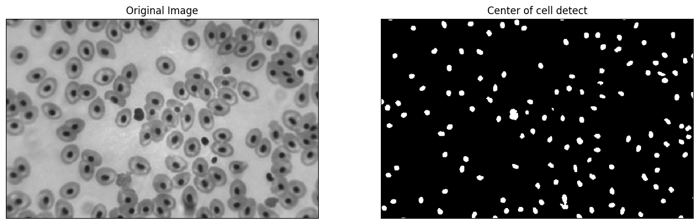

# Blood Cell Detection

## Problem count blood cell in original image


## Solving techniques
**Blood cell detection use color detection by opencv**
### Solving steps

1. Read original image from bloodcell.bmp file and convert to grayscale image
2. Save grayscale image becuace .bmp file can't convet color to HSV format in next step
3. Read grayscale image from BloodGray.png file and convet color format to HSV
4. Use color detection to detect center of blood cell by detect black color by function 
```python
# Black color in HSV is (0, 0, 0) 
# lower range in HSV
lower_range = (0, 0, 0) # lower is black color
# upper rangein HSV
upper_range = (0, 0, 75) # upper is black color in lightness 30%
# detect center of cell by color
mask = cv2.inRange(hsv_img, lower_range, upper_range)
```


5. Use contours area to detect blood cell in condition contours area < 205 if it true count that to blood cell and draw color on edge of that contour area

## Blood cell Detection Count is 129 cell


**Can view code in file : BloodCellDetection.ipynb**

Waritthon Kongnoo
