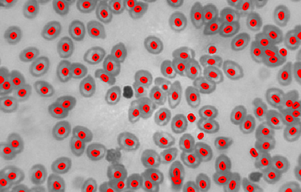

# Blood Cell Detection
---
**Blood cell Detection use color detection by opencv**

## Original Image

## Blood cell Detection Count is 132 cell
**Can view code in file : BloodCellDetection.ipynb**

Waritthon Kongnoo
